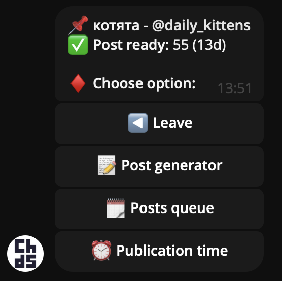
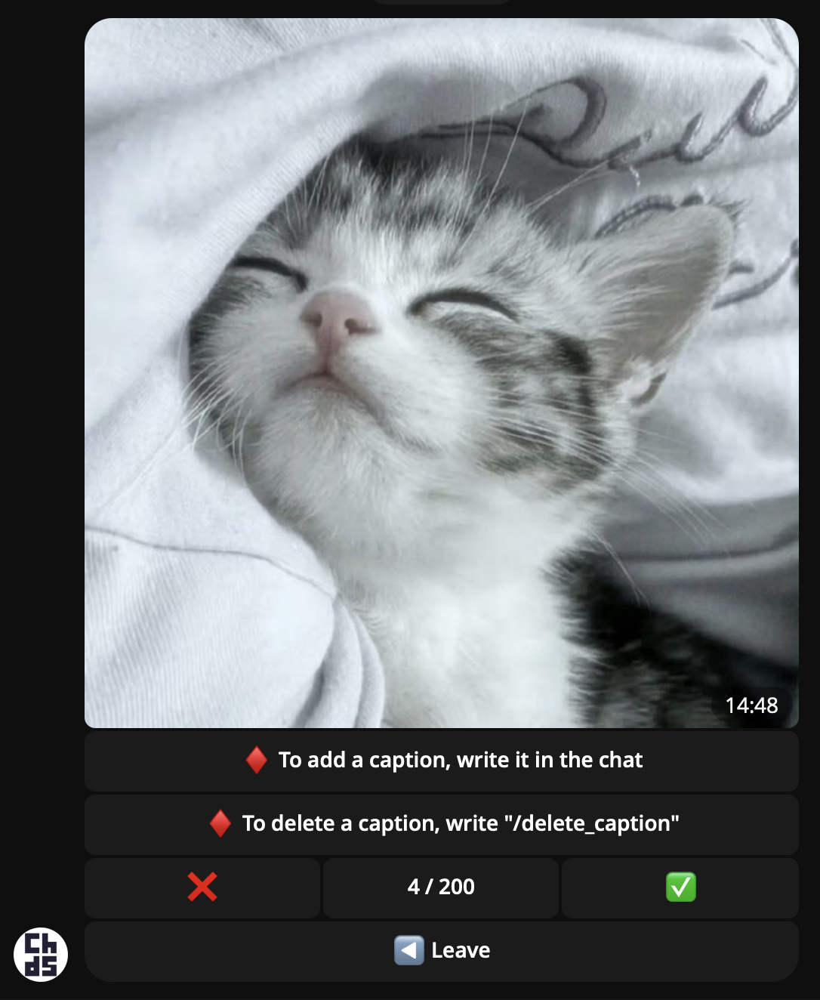
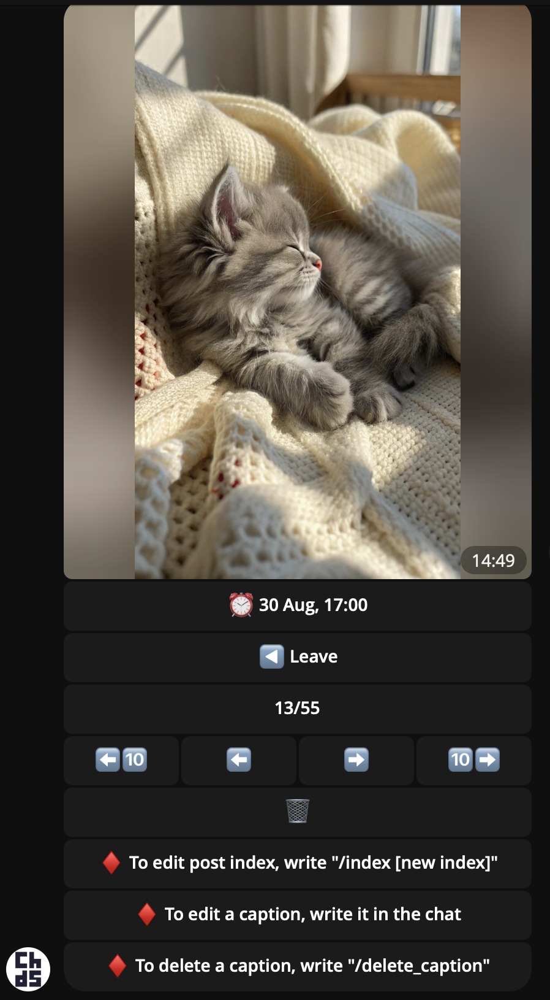
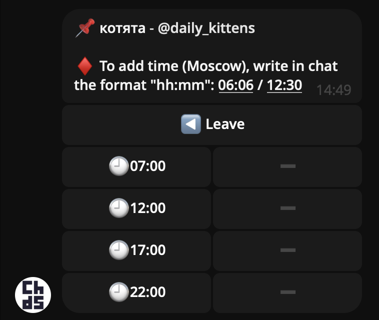

# Posting Bot  

🇬🇧 A Telegram bot for easily creating posts with pictures from Pinterest and automatically publishing them in channels. (For example, themed ones, such as channels with kittens)

🇷🇺 Telegram-бот для простого создания постов с картинками из Pinterest и автоматической публикации их в каналах. (Например, тематических, таких как каналы с котятами)

Built with **[aiogram 3.20](https://docs.aiogram.dev/)**.  

---

## 📑 Navigation  

- [🇬🇧 README [EN]](#-readme-en)  
- [🇷🇺 README [RU]](#-readme-ru)  
- [🖼 Screenshots](#-screenshots)  
- [⚖️ License](#️-license)  

---

## 🇬🇧 README [EN]  

### ✨ Features  

- 📌 Add a Telegram channel for content publishing.  
- 🖼 Generate posts from images parsed from **Pinterest**.  
- 📝 Option to add captions to images.  
- ⚡️ Convenient **Post generator** mode — create 100+ posts per hour.  
- ⏰ Automatic post publishing on schedule.  
- 🗓 Flexible publishing time settings (e.g., `07:00`, `12:00`, `17:00`, `22:00`).  
- 📂 Manage the post queue in **Post queue** menu (remove or reorder posts).  

---

## 🇷🇺 README [RU]  

### ✨ Возможности  

- 📌 Добавление Telegram-канала для публикации контента.  
- 🖼 Генерация постов из картинок, запаршенных с **Pinterest**.  
- 📝 Возможность добавлять подписи к картинкам.  
- ⚡️ Удобный режим **Post generator** — за час можно создать более 100 постов.  
- ⏰ Автопубликация постов по расписанию.  
- 🗓 Гибкая настройка времени публикации (например, `07:00`, `12:00`, `17:00`, `22:00`).  
- 📂 Просмотр очереди постов в меню **Post queue** (можно удалить или изменить порядок).  

---

## 🖼 Screenshots  

- Channels menu / Меню выбора канала

  

  🇬🇧 55 is the number of posts in the queue ; 13 is the number of days they will last based on the publication time
  
  🇷🇺 55 - количество постов в очереди ; 13 - количество дней на которых их хватит исходя из времени публикации 

- Channel menu / Меню канала

  

- Post generator / Меню генерации постов

    

- Post queue / Очередь постов

    

- Publication time / Меню настройки времени публикации

  

---

## ⚖️ License  

🇬🇧 This project is distributed under the **Personal Use License**.  
- ✅ Allowed for personal, educational, and research purposes.  
- ❌ Commercial use is prohibited without the author's written permission.  

🇷🇺 Этот проект распространяется под лицензией **Personal Use License**.  
- ✅ Разрешается использование в личных, учебных и исследовательских целях.  
- ❌ Коммерческое использование запрещено без письменного разрешения автора.  

Full license text / Полный текст лицензии: [LICENSE](./LICENSE).  
